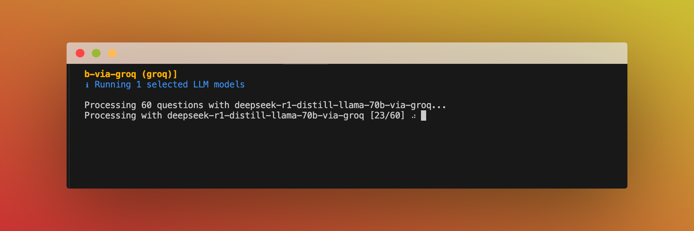
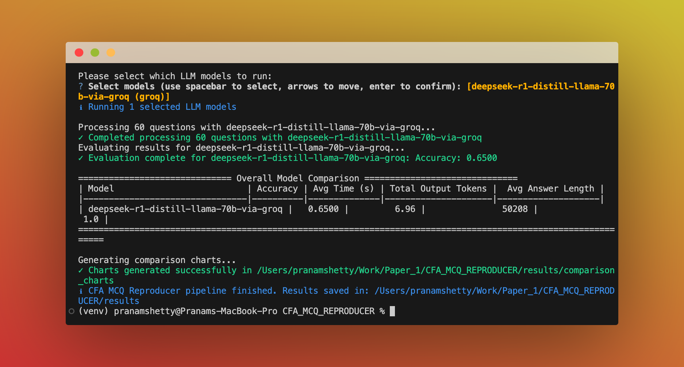

<p align="center">
  <a href="https://www.goodfin.com/" target="_blank">
    
  </a>
</p>

# CFA MCQ Question Reproducer

This project processes CFA MCQ questions using various Large Language Models (LLMs)
and evaluates their performance. It features an interactive UI with loading animations
and progress indicators to provide real-time feedback during processing.

## Benchmark Overview

This comprehensive LLM benchmark evaluates the performance of state-of-the-art language models on CFA multiple-choice questions, measuring both accuracy and efficiency metrics.

<table>
<thead>
<tr>
<th align="center">Benchmark Statistics</th>
<th align="center">Details</th>
<th align="center">Count</th>
</tr>
</thead>
<tbody>
<tr>
<td align="center"><strong>Models</strong></td>
<td>Claude-3.7-Sonnet, Claude-3.5-Sonnet, Claude-3.5-Haiku, Mistral-Large, Codestral, Palmyra-fin, GPT-4o, O3-mini, O4-mini, GPT-4.1, GPT-4.1-mini, GPT-4.1-nano, Grok-3, Grok-3-mini-beta (high/low effort), Gemini-2.5-Pro, Gemini-2.5-Flash, Deepseek-R1, Llama-4-Maverick, Llama-4-Scout, Llama-Guard-4, Llama-3.3-70B, Llama-3.1-8B-instant</td>
<td align="center"><strong>22+</strong></td>
</tr>
<tr>
<td align="center"><strong>Strategies</strong></td>
<td>Default, Chain of Thought (CoT), Self-Discover, Self-Consistency with different sample sizes (N=3, N=5)</td>
<td align="center"><strong>3-5</strong></td>
</tr>
<tr>
<td align="center"><strong>Metrics</strong></td>
<td>Accuracy, Precision, Recall, F1 score, Average Latency (ms), Total Input Tokens, Total Output Tokens, Total Tokens, Average Answer Length, Total Cost, Total Run Time</td>
<td align="center"><strong>11</strong></td>
</tr>
<tr>
<td align="center"><strong>Visualizations</strong></td>
<td>Model-Strategy Accuracy Comparison, Average Processing Time, Total Output Tokens, Combined Performance (Accuracy & Time), Accuracy/F1 Comparison (Default vs SC-CoT), Self-Consistency CoT Comparison (N=3 vs N=5), Accuracy/F1 vs Time Trade-off, Accuracy/F1 vs Cost Trade-off, Latency vs Cost Trade-off, Total Run Time Comparison, Default Strategy Metric Comparisons (Accuracy, F1, Latency), Confusion Matrices</td>
<td align="center"><strong>15+</strong></td>
</tr>
</tbody>
</table>

This benchmark analyzes over 22 state-of-the-art LLMs across multiple reasoning strategies, measuring 11 performance metrics, and generating 15+ detailed visualization plots to evaluate and compare their performance on CFA multiple-choice questions.

## Project Structure

```
CFA_MCQ_REPRODUCER/
├── data/
│   └── updated_data.json  # Input MCQ data (questions, correct answers)
├── results/
│   ├── comparison_charts/ # Output charts comparing model performance
│   └── *.json             # Raw JSON outputs for each model run
├── src/
│   ├── __init__.py
│   ├── config.py          # API keys, file paths, model configs, global settings
│   ├── llm_clients.py     # Functions for interacting with LLM APIs
│   ├── evaluations/       # Directory for performance evaluation modules
│   │   ├── classification.py # Classification metrics (accuracy, F1, etc.)
│   │   ├── resource_metrics.py # Resource usage (tokens, latency)
│   │   ├── cost_evaluation.py  # Cost estimation for various LLM providers
│   │   └── __init__.py
│   ├── plotting.py        # Chart generation functions
│   ├── prompts/           # Directory for LLM prompt templates
│   │   └── default.py     # Default prompt templates
│   │   └── cot.py         # Chain of Thought prompt templates
│   ├── utils/             # Utility functions
│   │   ├── ui_utils.py    # UI utilities (loading animations, colored output)
│   │   ├── prompt_utils.py # Prompt generation and parsing utilities
│   │   └── __init__.py    # (Likely, or add if not present)
│   └── main.py            # Main script to run the pipeline
├── .env                   # Local environment variables (API keys). Not version controlled.
├── requirements.txt       # Python package dependencies
└── README.md              # This file
```

## Setup

1.  **Clone the repository (if applicable) or ensure you have this directory structure.**

2.  **Create a virtual environment (recommended):**
    ```bash
    python -m venv venv
    source venv/bin/activate  # On Windows use `venv\Scripts\activate`
    ```

3.  **Install dependencies:**
    ```bash
    pip install -r requirements.txt
    ```

4.  **Set up API Keys:**
    Create a `.env` file in the `CFA_MCQ_REPRODUCER` directory (i.e., at the same level as `src/` and `data/`).
    Add your API keys to this file. Example `.env` content:

    ```env
    OPENAI_API_KEY="your_openai_api_key"
    GEMINI_API_KEY="your_gemini_api_key"
    XAI_API_KEY="your_xai_api_key_for_grok"
    WRITER_API_KEY="your_writer_api_key"
    AWS_ACCESS_KEY_ID="your_aws_access_key_id"
    AWS_SECRET_ACCESS_KEY="your_aws_secret_access_key"
    AWS_REGION="your_aws_region" # e.g., us-east-1
    GROQ_API_KEY="your_groq_api_key"
    ANTHROPIC_API_KEY="your_anthropic_api_key"
    ```
    The script will load these variables. Alternatively, you can set them as system environment variables.

5.  **Prepare Input Data:**
    - Place your MCQ data file into the `CFA_MCQ_REPRODUCER/data/` directory. The script currently expects a file named `updated_data.json` (configurable in `src/config.py`).
    - **Required Data Structure:** The JSON file must contain a list of objects, where each object represents a question and should include keys like `question`, `options` (a dictionary like `{"A": "...", "B": "..."}`), `correct_answer` (the letter key, e.g., "A"), and potentially `explanation` or other metadata.

## Running the Pipeline

Navigate to the `CFA_MCQ_REPRODUCER` directory in your terminal.
Run the main script as a module:

```bash
python -m src.main
```

This will:
- Load data from `data/updated_data.json` with a loading animation.
- **Prompt you to choose a run mode:**
  - **Full Evaluation:** Runs all available models with the Default, Self-Consistency CoT (N=3), and Self-Consistency CoT (N=5) strategies automatically.
  - **Custom Run:** Allows you to interactively select specific models and a single strategy to run.
- Process each question with the selected configurations, showing real-time progress.
- Display colored success/error messages for each operation.
- Save detailed results for each model-strategy combination to a JSON file in the `results/` directory.
- Calculate and display evaluation metrics (e.g., accuracy, F1 score, estimated cost).
- **Save an aggregated summary of all metrics** to `results/all_runs_summary_metrics.csv`.
- Generate a comprehensive suite of comparison charts in `results/comparison_charts/`.
- Present a formatted summary table of results in the console.

### Interactive UI Features

The program now includes several UI enhancements:

1. **Loading Animations**: Displayed during long-running operations like:
   - Data loading
   - Model selection
   - LLM processing (with progress updates)
   - Evaluation
   - Chart generation
   - Results saving

2. **Progress Indicators**: Shows real-time progress during LLM processing:
   ```
   Processing with GPT-4 [15/50] ⠋
   ```

3. **Colored Output**:
   - ✓ Success messages in green
   - ✗ Error messages in red
   - ℹ Info messages in blue
   - ⚠ Warning messages in yellow

4. **Real-time Processing**: View the progress as the selected LLMs process the questions:



5. **Formatted Results Summary**: Displays a clear table of results at the end of processing:



6.  **Performance Visualization**: Generates and saves a suite of comparison charts in `results/comparison_charts/` for comprehensive analysis of model and strategy performance. Interactive HTML versions are also saved alongside static PNG images. Key outputs include:
    *   **Aggregated Metrics Summary (`results/all_runs_summary_metrics.csv`)**: A CSV file containing key metrics for every model-strategy combination executed. Columns include: `run_id`, `model_id_full`, `base_model_id`, `strategy_name`, `strategy_type`, `strategy_param`, `display_name`, `accuracy`, `f1_score`, `avg_time_per_question`, `total_run_time`, `total_output_tokens`, `total_cost`.
    *   **Model-Strategy Accuracy Comparison (`model_strategy_comparison_accuracy.png`/`.html`)**: Bar chart visualizing the accuracy scores for each model-strategy combination. Higher bars denote better performance.
    *   **Average Processing Time per Question (`model_strategy_comparison_response_time.png`/`.html`)**: Bar chart showing the average time (in seconds) each model-strategy took per question. Lower bars indicate faster processing.
    *   **Total Output Tokens Generated (`model_strategy_comparison_output_tokens.png`/`.html`)**: Bar chart illustrating the total output tokens generated by each configuration. Useful for assessing verbosity and potential costs.
    *   **Combined Performance: Accuracy & Avg. Question Time (`model_strategy_combined_metrics.png`/`.html`)**: Dual-axis chart presenting accuracy (bars) and average processing time (line) together for evaluating speed vs. accuracy trade-offs.
    *   **Accuracy/F1 Comparison: Default vs. SC-CoT (N=3) (`comparison_<metric>_by_strategy.png`/`.html`)**: Grouped bar chart directly comparing the performance (Accuracy and F1 Score) of the Default strategy against the Self-Consistency CoT (N=3) strategy for each base model.
    *   **Self-Consistency CoT Comparison: N=3 vs. N=5 (`comparison_sc_<metric>_n3_vs_n5.png`/`.html`)**: Grouped bar chart comparing the performance (Accuracy and F1 Score) between N=3 and N=5 samples for the Self-Consistency CoT strategy across models.
    *   **Accuracy/F1 vs. Time Trade-off (`tradeoff_<metric>_vs_time.png`/`.html`)**: Scatter plot visualizing the relationship between performance (Accuracy or F1 Score) on the Y-axis and Average Time per Question on the X-axis. Points are colored by model and shaped by strategy type, helping identify efficient configurations.
    *   **Total Run Time Comparison by Strategy (`comparison_total_time_by_strategy.png`/`.html`)**: Grouped bar chart showing the *total* time taken to process all questions for each model, grouped by strategy. This provides a view of the overall execution duration for each configuration.
    *   **Default Strategy - Accuracy Comparison (`default_strategy_accuracy_comparison.png`/`.html`)**: Bar chart comparing the accuracy of all tested models when using only the 'default' prompt strategy. Allows for clear model-to-model comparison under the baseline strategy.
    *   **Default Strategy - F1 Score Comparison (`default_strategy_f1_score_comparison.png`/`.html`)**: Bar chart comparing the F1-score of all tested models when using only the 'default' prompt strategy.
    *   **Default Strategy - Latency Comparison (`default_strategy_average_latency_ms_comparison.png`/`.html`)**: Bar chart comparing the average processing time (latency in milliseconds) of all tested models when using only the 'default' prompt strategy.

## Configuration

-   **Supported LLM Providers and Models:** This project is designed to work with a variety of LLM providers. Support is integrated for:
    - OpenAI (e.g., GPT-4o, GPT-4.1 series)
    - Google Gemini (e.g., Gemini 2.5 Pro, Gemini 2.5 Flash with `thinking_budget`)
    - Anthropic (e.g., Claude 3.7 Sonnet, Claude 3.5 Sonnet & Haiku)
    - Groq (e.g., Llama 4 Maverick/Scout, Llama 3.3 70B, Llama 3.1 8B, with `reasoning_effort` for Grok models)
    - Writer.com (e.g., Palmyra-fin)
    - xAI (e.g., Grok-3)
    - AWS Bedrock (various models like Deepseek, Mistral, Meta Llama)
    - AWS SageMaker (custom deployed endpoints)
    Specific model IDs, versions, and their parameters are defined within the Python files in the `src/configs/` directory (e.g., `default_config.py`, `cot_config.py`).

-   **Model Selection & Parameters:** Edit the configuration files within the `src/configs/` directory (e.g., `default_config.py`). These files list the available models (`config_id`), their corresponding API identifiers (`model_id`), types (`type` which maps to the correct API client in `llm_clients.py`), and strategy-specific parameters. You can add, remove, or modify entries here to control which models are available for selection and how they behave.
    - For example, a model configuration entry might look like this:
      ```python
      {
          "config_id": "gemini-2.5-flash",
          "type": "gemini",
          "model_id": "gemini-2.5-flash-preview-04-17",
          "parameters": {
              "top_p": 0.95,
              "top_k": 64,
              "max_output_tokens": 10,
              "thinking_budget": 0 
          }
      }
      ```
    - Note that some models support unique parameters that significantly affect their behavior and cost, such as `thinking_budget` for certain Gemini models (e.g., Gemini 2.5 Flash) or `reasoning_effort` for Groq models (e.g., `grok-3-mini-beta`). Ensure these are configured appropriately in the `parameters` section of the model's configuration.
    - Groq models (`grok-3-mini-beta` and `grok-3-mini-fast-beta`) now have configurations for `high` and `low` `reasoning_effort` respectively.
-   **API Keys & File Paths:** Global settings like API key environment variable names and default data/results paths can be adjusted in `src/config.py` if needed, though using the `.env` file is recommended for keys.
-   **Prompt Templates:** Modify or add prompt templates in the `src/prompts/` directory (e.g., `default.py`, `cot.py`) to change how questions are presented to the LLMs for different strategies.